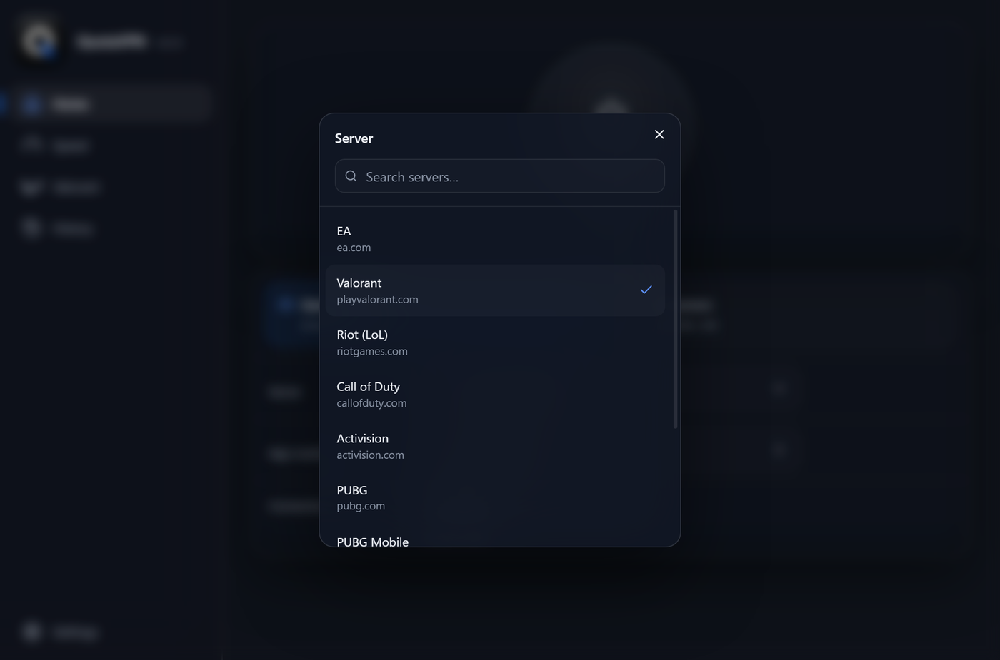
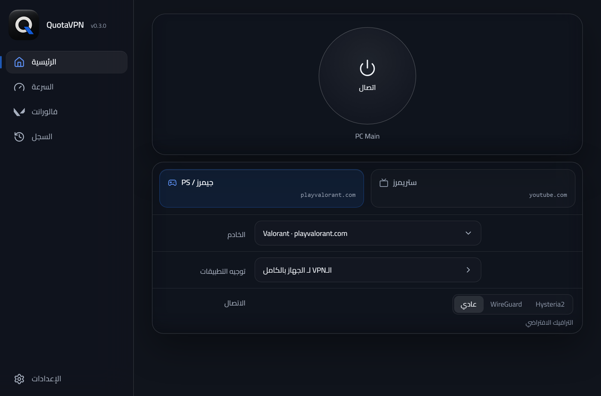

**Website:** https://yousefmohiey.github.io/QuotaCards/

**QuotaVPN** (formerly QuotaCards) is a personal VPN built for ISPs that sell your line in quota buckets. What a connection counts against is decided from the TLS handshake, so QuotaVPN makes your traffic ride the bucket you pick: your gaming or streaming package, or general quota. One Windows app, one Android app, full English and Arabic, and both update themselves from this repo.

## Screenshots

One tap connects. The profile tiles pick the quota class, the Server row picks the address, and the session counters run while you are on.

Every profile carries its own server list: gaming domains for Gamerz, streaming domains for Streamerz, plus any custom server you want.

Arabic ships complete and formal. The layout keeps its shape, nothing mirrors.

## Download

Latest build from [Releases](https://github.com/YousefMohiey/QuotaCards/releases/latest):

- **Windows**: `QuotaVPN_<version>_x64-setup.exe`. Installs per user, no admin needed. After that the app updates itself: Settings, Updates, or the tray.
- **Android**: the signed APK from the same page. Sideload it once, then it updates itself from here.

Runs on Windows 10/11 and modern Android.

## How it works

Your ISP classifies a connection from the TLS handshake at its start. QuotaVPN gives each connection an SNI from your package's own whitelist (Gamerz: EA, Riot, Call of Duty, PUBG, Steam and friends; Streamerz: YouTube, Meta, X, Prime Video, OSN+ and friends), so the session lands in the bucket you picked.

| Mode | Transport | Counts from |
|------|-----------|-------------|
| Standard | VLESS on TCP 443 with the class SNI | Your package (Gamerz / Streamerz) |
| WireGuard | Raw UDP, no TLS handshake | General quota |
| Hysteria2 | UDP 443 with the same SNI | General quota (ISPs read SNI off TCP only) |

Standard spends your package class. WireGuard and Hysteria2 spend general quota and are the raw-speed options.

## The Windows app

- One-tap connect with live session time and up/down counters
- Two profiles, Gamerz and Streamerz, each with its own server list (and a custom server option)
- Per-app routing: whole device, only these apps, or everything except
- Speed screen: ping, download and upload against your own server, with history
- Its own engine (sing-box + wintun): traffic goes through the tunnel or nowhere, no leak path
- Signed updates: the app downloads the signed setup and installs it for you

## The Android app

- Whole-device tunnel (VpnService + sing-box), Quick Settings tile
- Per-app routing, Always-on VPN compatible, swipe-away safe
- Same profiles and server lists as the desktop, full Arabic
- Updates itself from GitHub Releases

## Self-hosting the server

You bring Ubuntu 22.04+ (Oracle Always Free works). Two scripts in `embed/`:

1. `qc-fresh.sh` - Xray (VLESS TCP/443) plus a restricted `qc-agent` key
2. `qc-net.sh` - Hysteria2 (UDP/443), WireGuard (UDP/51820, plus a UDP/53 fallback for ISPs that filter the default port) and helpers

Open these on the instance subnet's security list (the list attached to that subnet, not an old one):

| Direction | Protocol | Port | Used by |
|-----------|----------|------|---------|
| In | TCP | 22 | setup SSH |
| In | TCP | 443 | Standard |
| In | UDP | 443 | Hysteria2 |
| In | UDP | 51820 | WireGuard |
| In | UDP | 53 | WireGuard fallback |

Point a DuckDNS (or any) name at the box and refresh it on a cron; the app resolves it on every connect. SSH stays key-only, and the day-to-day key is restricted to adding, revoking and listing clients.

## Project layout

- `desktop/ui-next/` - Windows UI (React 19 + Tailwind v4, EN + AR, the glass theme)
- `desktop/src-tauri/` - Windows backend: whole-PC sing-box + wintun engine, live process list, tray, updater
- `android/tauri-app/` - Android app: the shared Rust core with the phone UI
- `android/tauri-plugin-qctunnel/` - Kotlin `VpnService`, libbox engine, Quick Settings tile, per-app picker
- `src/` - Rust core shared by both apps
- `embed/` - server scripts plus the restricted agent key (`*.pem` is gitignored, never committed)
- `docs/` - handoff, architecture, status

Building needs Rust stable and Node; the APK additionally needs Android SDK 35, NDK 28 and JDK 23. Windows release: `npm run build` in `desktop/ui-next` then a Tauri build with the signing env; Android release: `bash tools/build-apk.sh` (see `docs/HANDOFF.md`). No tokens or passwords live in this repo; the DuckDNS token lives only in the server crontab.

## Docs

- `docs/HANDOFF.md` - the full system map: flows, code map, build and release, traps
- `docs/ARCHITECTURE.md` - how it is built, file by file
- `docs/STATUS.md` - what works, known issues, roadmap

## License

MIT, see [LICENSE](LICENSE). Built by Yousef Mohiey.
