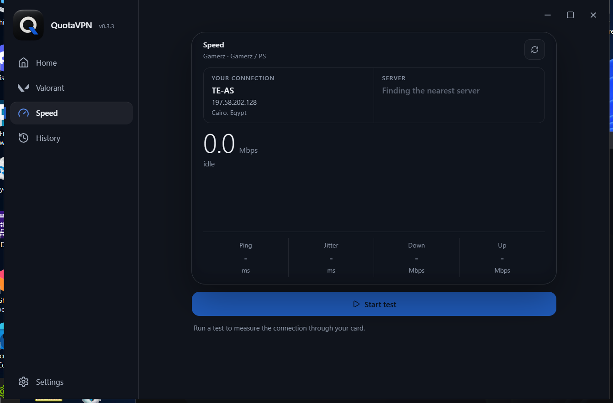
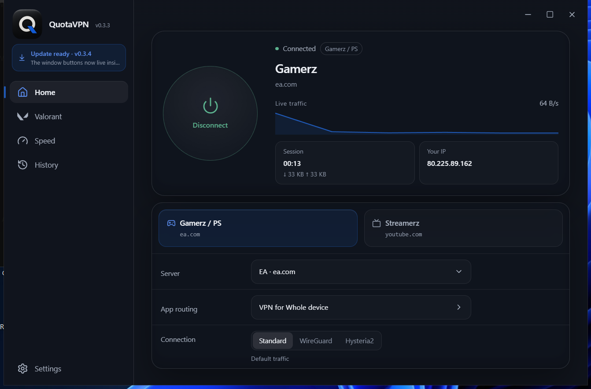

# QuotaVPN

A personal VPN for Windows and Android that makes your traffic ride the data package you pick: gaming, streaming, or general quota.

**Website:** https://yousefmohiey.github.io/QuotaVPN/ · **Download:** [latest release](https://github.com/YousefMohiey/QuotaVPN/releases/latest)

## Download

| Platform | File | Notes |
|----------|------|-------|
| Windows 10/11 | `QuotaVPN_<version>_x64-setup.exe` | Installs per user, no admin needed. Updates itself after that. |
| Android | `QuotaVPN-mobile-signed.apk` | Sideload once. Updates itself from the same releases page. |

## Try it without installing

The website carries two live demos, both built from the same source the apps ship:

- Windows interface: https://yousefmohiey.github.io/QuotaVPN/app/
- Android interface: https://yousefmohiey.github.io/QuotaVPN/phone/

Press Connect, move between screens, run a speed test. Nothing is routed and nothing is installed.

## What it does

Your ISP classifies a connection from the TLS handshake at its start, and that is what decides which quota it counts against. QuotaVPN puts a server name from your chosen package on that handshake, so the session lands in the bucket you picked.

- **Two profiles, Gamerz and Streamerz**, each with its own server list (EA, Riot, Steam, YouTube, Meta, Prime Video and friends) plus any custom server you add.
- **Three transports, honestly labelled.** Standard spends your package class; WireGuard and Hysteria2 spend general quota and are the raw-speed options.
- **Per-app routing** on both platforms: whole device, only these apps, or everything except them.
- **Speed screen** with ping, download and upload against the QuotaVPN server, plus history.
- **Full English and Arabic**, in both apps. The layout keeps its shape; nothing mirrors.
- **Signed self-updates.** The app downloads the signed installer and applies it for you.

## Screenshots

| Connected | Speed test | Profiles |
|---|---|---|
|  |  |  |

One tap connects. The profile tiles pick the quota class, the Server row picks the address, and the session counters run while you are on.

## How it works

| Mode | Transport | Counts from |
|------|-----------|-------------|
| Standard | VLESS on TCP 443 with the class SNI | Your package (Gamerz / Streamerz) |
| WireGuard | Raw UDP, no TLS handshake | General quota |
| Hysteria2 | UDP 443 with the same SNI | General quota (ISPs read SNI off TCP only) |

The engine is sing-box: on Windows it runs with wintun inside the app, on Android it runs through `VpnService` with libbox. Traffic goes through the tunnel or nowhere.

## Self-hosting the server

You bring Ubuntu 22.04+ (Oracle Always Free works). Two scripts in `embed/`:

1. `qc-fresh.sh` - Xray (VLESS TCP/443) plus a restricted `qc-agent` key
2. `qc-net.sh` - Hysteria2 (UDP/443), WireGuard (UDP/51820, plus a UDP/53 fallback for ISPs that filter the default port) and helpers

Open these on the instance subnet's security list (the list attached to that subnet, not an old one):

| Direction | Protocol | Port | Used by |
|-----------|----------|------|---------|
| In | TCP | 22 | setup SSH |
| In | TCP | 443 | Standard |
| In | UDP | 443 | Hysteria2 |
| In | UDP | 51820 | WireGuard |
| In | UDP | 53 | WireGuard fallback |

Point a DuckDNS (or any) name at the box and refresh it on a cron; the app resolves it on every connect. SSH stays key-only, and the day-to-day key is restricted to adding, revoking and listing clients.

## Project layout

- `desktop/ui-next/` - Windows UI (React 19 + Tailwind v4, EN + AR, the glass theme)
- `desktop/src-tauri/` - Windows backend: whole-PC sing-box + wintun engine, live process list, tray, updater
- `android/tauri-app/` - Android app: the shared Rust core with the phone UI
- `android/tauri-plugin-qctunnel/` - Kotlin `VpnService`, libbox engine, Quick Settings tile, per-app picker
- `src/` - Rust core shared by both apps
- `embed/` - server scripts plus the restricted agent key (`*.pem` is gitignored, never committed)
- `docs/` - handoff, architecture, status

Building needs Rust stable and Node; the APK additionally needs Android SDK 35, NDK 28 and JDK 23. Windows release: `npm run build` in `desktop/ui-next` then a Tauri build with the signing env; Android release: `bash tools/build-apk.sh` (see `docs/HANDOFF.md`). No tokens or passwords live in this repo; the DuckDNS token lives only in the server crontab.

## Docs

- `docs/HANDOFF.md` - the full system map: flows, code map, build and release, traps
- `docs/ARCHITECTURE.md` - how it is built, file by file
- `docs/STATUS.md` - what works, known issues, roadmap

## License

MIT, see [LICENSE](LICENSE). Built by Yousef Mohiey.
